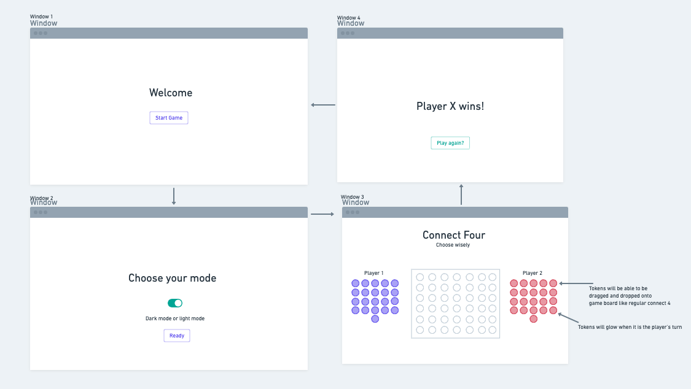

<h1>Power Four</h1>
Power Four, otherwise known as Connect Four, is a strategy game for two people. Players take turns dropping their tokens into the grid, stacking them vertically, horizontally, or diagonally. Players use strategy to block the other player's moves. The first person to get four in a row wins. This is a childhood favorite of mine and I hope you enjoy it too!

<h2>To Play</h2>
The game is deployed <a href="https://amazing-liskov-5c062c.netlify.app/">here</a>.

Just click on the column on the grid where you would like to place your token. The token will fill in the lowest available space. Once a player places their token the turn will immediately switch to the other player. Keep placing tokens until one player achieves four of their tokens in a row.

<h2>Screenshots</h2>

<h2>Languages</h2>
<ul>
  <li>Javascript</li>
  <li>HTML</li>
  <li>CSS</li>
</ul>

<h2>Wireframe</h2>

<h2>Future Improvements</h2>
<ul>
  <li>Add more elements that change in light/dark mode</li>
  <li>Add player turn indicator in smaller screen views</li>
  <li>Possibility to play against the computer</li>
</ul>

<h2>Built With</h2>
<ul>
  <li><b>Font:</b> Google Fonts https://fonts.google.com/</li>  
  <li><b>Buttons:</b> Bootstrap https://getbootstrap.com/docs/5.1/components/buttons/</li>
  <li><b>HUD Image:</b> Hud Vectors by Vecteezy https://www.vecteezy.com/free-vector/hud</li>
  <li><b>Star Background Image:</b> Wallpaper Bat https://wallpaperbat.com/green-galaxy-wallpapers</li>
  <li><b>Favicon:</b> Token by Lars Meiertoberens from the Noun Project https://thenounproject.com/</li>
  <li><b>Sound fx:</b> FreeSFK https://www.freesfx.co.uk/Default.aspx</li>
  <li><b>Neon effect:</b> CSS Tricks https://css-tricks.com/how-to-create-neon-text-with-css/</li>
</ul>
